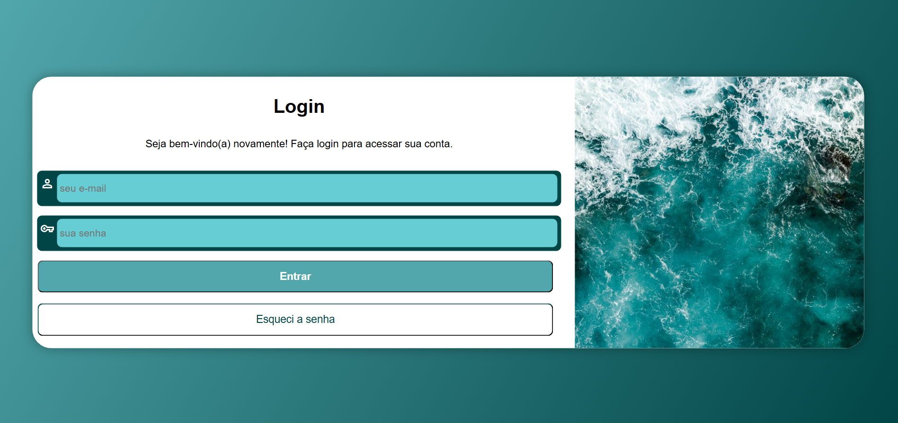
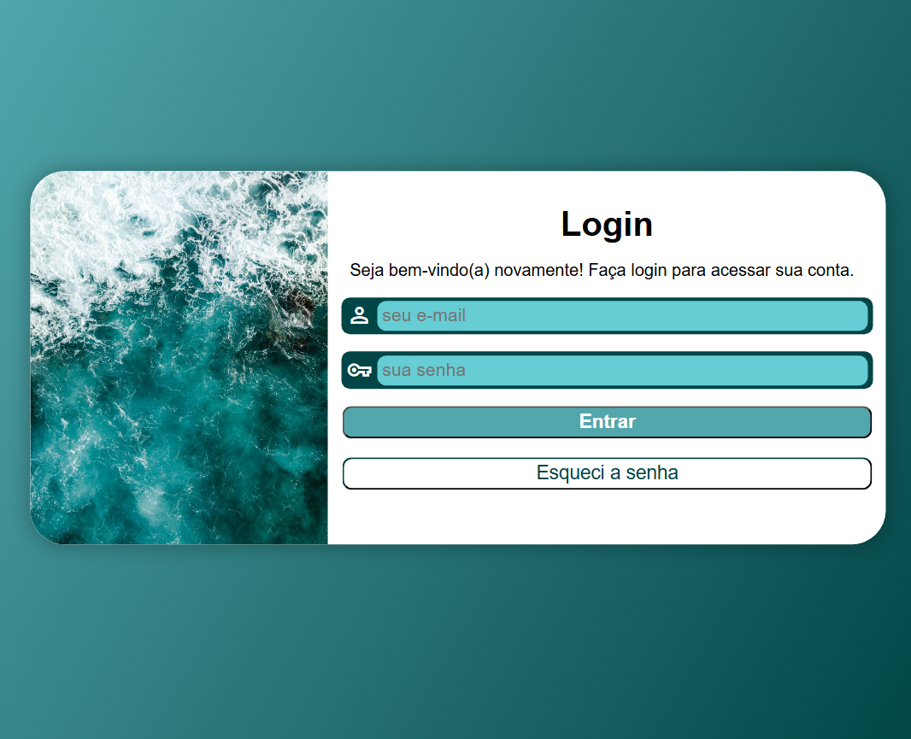
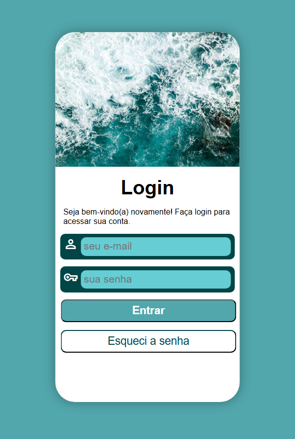

# Projeto Login

## Sobre o projeto

O **Projeto Login** é uma página responsiva de autenticação desenvolvida com **HTML5** e **CSS3**, criada durante o curso de HTML e CSS do **Curso em Vídeo**, ministrado pelo professor Gustavo Guanabara.

O principal objetivo deste projeto foi colocar em prática conceitos essenciais de desenvolvimento front-end, com foco na criação de um formulário moderno, organizado e adaptável a diferentes tamanhos de tela. Para isso, foram utilizados recursos como **Media Queries**, permitindo que a interface proporcione uma boa experiência tanto em dispositivos móveis quanto em desktops.

O projeto também reforça boas práticas de estruturação de código, semântica HTML e organização de estilos em CSS.

---

## Funcionalidades

- Interface moderna para tela de login.
- Formulário de autenticação.
- Campos para e-mail e senha.
- Botões de login e recuperação de senha.
- Layout totalmente responsivo.
- Adaptação automática para diferentes resoluções de tela.
- Organização do código utilizando HTML semântico e CSS.

---

## Tecnologias utilizadas

- HTML5
- CSS3
- Media Queries
- Visual Studio Code

---

## Conceitos praticados

Durante o desenvolvimento deste projeto foram aplicados conceitos importantes, como:

- Estruturação semântica em HTML.
- Criação e estilização de formulários.
- Utilização de Media Queries.
- Responsividade para múltiplos dispositivos.
- Posicionamento de elementos com CSS.
- Organização e separação de estilos.
- Boas práticas de desenvolvimento front-end.

---

## Demonstração

**Acesse o projeto:**  
<a href="https://pedroaraujo07.github.io/projeto-login/" target="_blank">Link do site</a>

#### Desktop

  

### Tablet

  

### Smartphone

  

